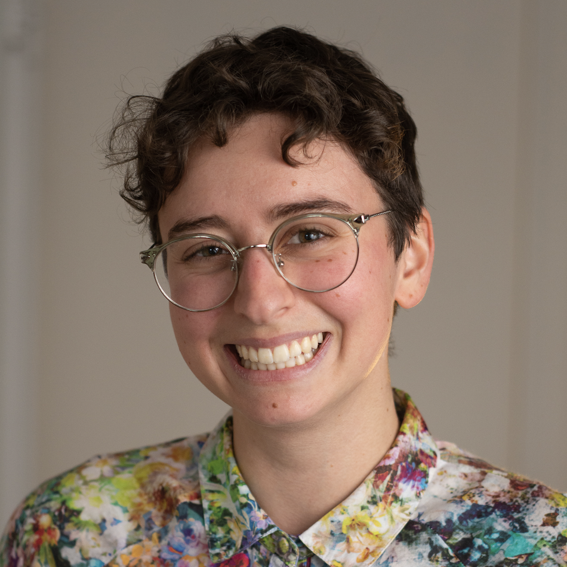

# About Me

This website is under construction ! 

I am a graduate student in Debora Marks' lab where I research ML for Biology. 

Most of my time is spent: 
-   designing new enzymes, 
-   developing new methods for combining natural sequence data with labeled experimental data, 
-   and mentoring future/current PhD students. 

**If you need something, feel free to reach out via email _:)_**
